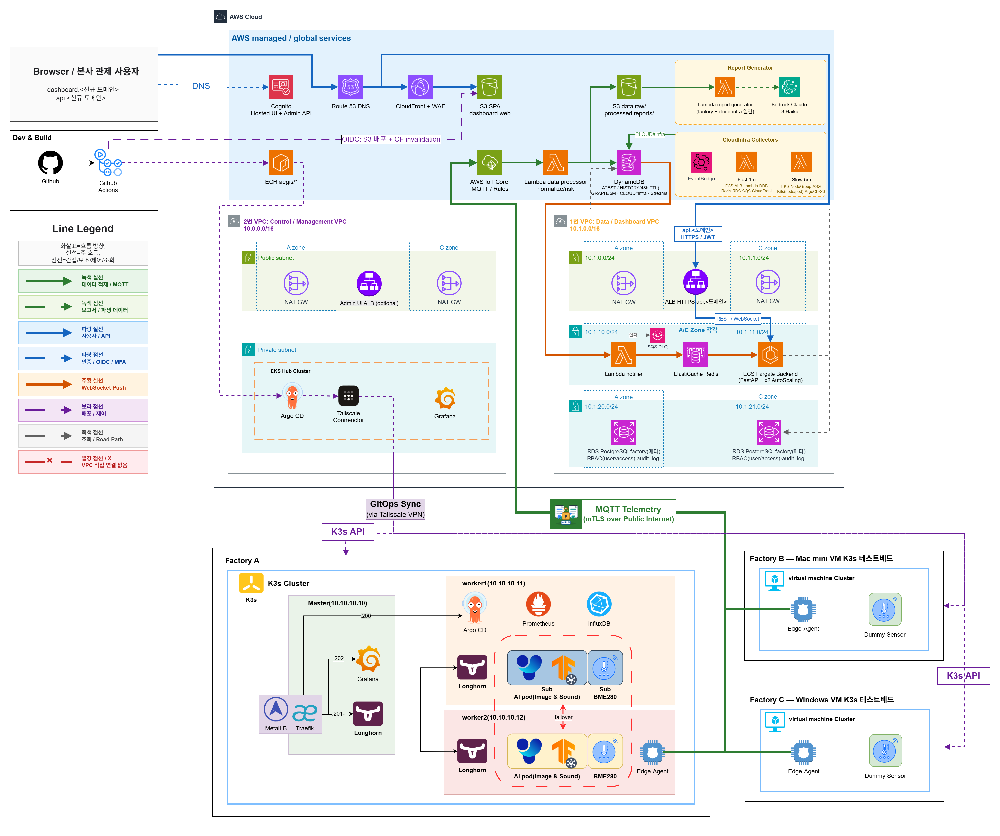

# Aegis-Pi Risk Twin

> Safe-Edge 단일 공장 엣지를 AWS 기반 멀티 공장 중앙 관제 구조로 확장하는 Risk Twin 플랫폼



Aegis-Pi는 Raspberry Pi 3-node K3s로 구성한 `factory-a` 현장 엣지에서 센서·AI·운영 상태를 수집하고, AWS IoT/Lambda/DynamoDB/S3/Data Dashboard로 연결해 본사 관제자가 공장별 위험도와 인프라 상태를 확인할 수 있게 만든 프로젝트입니다.

- Dashboard: `https://dashboard.aegis-pi.cloud`
- API: `https://api.aegis-pi.cloud`
- 운영 문서: [Data/Dashboard VPC Runbook](docs/ops/22_data_dashboard_vpc_runbook.md)
- 현재 상태: [Session State](docs/issues/SESSION_STATE.md)

---

## 빠른 확인

Data/Dashboard VPC 올리기:

```bash
scripts/build/build-data-dashboard.sh
```

Data/Dashboard VPC 내리기:

```bash
scripts/destroy/destroy-data-dashboard.sh --domain aegis-pi.cloud
```

자동화 환경에서 대화형 확인을 생략해야 할 때만:

```bash
scripts/destroy/destroy-data-dashboard.sh --domain aegis-pi.cloud --yes
```

상세 절차와 destroy 후 잔여 자원 기준은 [Quick Start](docs/ops/00_quick_start.md)와 [Data/Dashboard VPC Runbook](docs/ops/22_data_dashboard_vpc_runbook.md)을 따릅니다.

---

## Core Design

- Edge-first baseline: `factory-a`는 Raspberry Pi 3-node K3s, Longhorn, MetalLB, ArgoCD, Grafana 기준선으로 운영합니다.
- Split VPC architecture: Control/Management VPC와 Data/Dashboard VPC를 분리해 제어 평면과 관제 데이터 평면을 나눕니다.
- Hot store first: Dashboard는 DynamoDB `LATEST`/`HISTORY`와 `GRAPH#5M` 집계를 우선 조회하고, S3 raw/processed는 원본 보존·재처리·보고서 입력으로 둡니다.
- Rebuildable demo ops: 비용 제어를 위해 `infra/data-dashboard/`는 build/destroy 가능하게 두고, DNS/Cognito/ECR/S3 Web/CloudFront는 permanent root로 분리합니다.
- App-level access control: Cognito 로그인 후 FastAPI가 RDS RBAC 메타데이터로 공장별 접근 권한을 검증합니다.
- Workstream boundary: `infra/foundation/`, `infra/hub/`, Admin UI, ArgoCD, Tailscale, shared S3/IoT 자원은 워크스트림 A 영역이며 Data/Dashboard destroy 대상이 아닙니다.

---

## Architecture Overview

```text
factory-a K3s
  -> Edge Agent / sensor / AI events
  -> AWS IoT Core
  -> S3 raw
  -> Lambda data processor
  -> DynamoDB LATEST/HISTORY/GRAPH + S3 processed
  -> ECS FastAPI Backend + Redis + RDS RBAC
  -> CloudFront/S3 Dashboard Web
```

주요 구성:

| 영역 | 구현 |
| --- | --- |
| Edge | Raspberry Pi 3-node K3s, Longhorn, MetalLB, ArgoCD, Grafana, AI/audio/BME280 workloads |
| Data plane | IoT Core, Lambda data processor, DynamoDB, S3 raw/processed/reports |
| Dashboard backend | FastAPI on ECS Fargate, ALB, Redis Pub/Sub, RDS PostgreSQL metadata/RBAC |
| Dashboard web | Vite + React SPA, S3 static hosting, CloudFront, Cognito |
| Cloud infra monitoring | EventBridge scheduled collectors, DynamoDB `CLOUD#infra`, Dashboard Cloud Infra page |
| CI/CD | GitHub Actions test/build/deploy, ECR `sha-<7char>` images, CloudFront invalidation |

---

## Terraform Roots

| root | 역할 |
| --- | --- |
| `infra/data-dashboard/` | VPC, NAT, ALB, ECS Backend, RDS, Redis, Lambda, runtime secrets 등 재생성 자원 |
| `infra/data-dashboard-dns/` | Route53 hosted zone. destroy 후에도 유지 |
| `infra/data-dashboard-permanent/` | Cognito, ECR, S3 Web, CloudFront, report table, GitHub OIDC roles. destroy 후에도 유지 |
| `infra/foundation/` | shared S3/IoT/AMP/ECR/OIDC 기반 자원. 워크스트림 A 소유, Data/Dashboard build/destroy 대상 아님 |
| `infra/hub/` | EKS Hub, Admin UI, ArgoCD, Tailscale 등 Control/Management VPC. 워크스트림 A 소유 |

---

## Repository Layout

```text
apps/
  dashboard-backend/        FastAPI Dashboard API
  dashboard-web/            Vite + React Dashboard SPA
  data-processor/           IoT -> DDB/S3 Lambda processor
  lambda-notifier/          DDB Streams -> Redis Pub/Sub
  cloud-infra-collector/    AWS 상태 수집 Lambda

infra/
  data-dashboard/           재생성 Data/Dashboard root
  data-dashboard-dns/       Route53 hosted zone root
  data-dashboard-permanent/ Cognito/ECR/S3 Web/CloudFront root
  hub/, foundation/         워크스트림 A 영역

scripts/
  build/                    rebuild entrypoints
  destroy/                  destroy entrypoints
  ops/                      rollout and operator helpers

docs/
  ops/                      운영 source of truth
  planning/                 설계와 workplan
  changes/                  ADR/change records
  issues/                   milestone/session tracker
  architecture/             architecture diagrams
```

---

## Documentation

| 목적 | 문서 |
| --- | --- |
| 운영 빠른 시작 | [docs/ops/00_quick_start.md](docs/ops/00_quick_start.md) |
| Data/Dashboard 운영 | [docs/ops/22_data_dashboard_vpc_runbook.md](docs/ops/22_data_dashboard_vpc_runbook.md) |
| 비용 기준 | [docs/ops/15_aws_cost_baseline.md](docs/ops/15_aws_cost_baseline.md) |
| 현재 세션 상태 | [docs/issues/SESSION_STATE.md](docs/issues/SESSION_STATE.md) |
| AI agent 작업 기준 | [docs/AI_AGENT_HARNESS.md](docs/AI_AGENT_HARNESS.md) |
| Data/Dashboard workplan | [docs/planning/16_data_dashboard_vpc_workplan.md](docs/planning/16_data_dashboard_vpc_workplan.md) |
| 최종 아키텍처 | [docs/planning/15_cloud_architecture_final.md](docs/planning/15_cloud_architecture_final.md) |
| 변경 결정 기록 | [docs/changes/README.md](docs/changes/README.md) |

---

## 검증

Backend:

```bash
cd apps/dashboard-backend
pytest -q
```

Frontend:

```bash
cd apps/dashboard-web
npm run lint
npm test -- --run
npm run build
```

Terraform:

```bash
terraform -chdir=infra/data-dashboard fmt -check
terraform -chdir=infra/data-dashboard validate
terraform -chdir=infra/data-dashboard-permanent fmt -check
terraform -chdir=infra/data-dashboard-permanent validate
terraform -chdir=infra/data-dashboard-dns fmt -check
terraform -chdir=infra/data-dashboard-dns validate
```

운영 health:

```bash
curl -fsS https://api.aegis-pi.cloud/healthz
curl -fsS https://api.aegis-pi.cloud/readyz
curl -fsSI https://dashboard.aegis-pi.cloud/ | head
```

---

## Scope

현재 제공:

- `factory-a` Safe-Edge 기준선
- Data/Dashboard VPC
- Dashboard Web/API
- Cognito + RDS RBAC 사용자 관리
- Cloud Infra 상태 화면
- S3 보고서 조회
- 이미지 스냅샷 조회
- AI 채팅 데이터 QA

후속:

- 인증 사용자 기반 Bedrock tool-use 질의 수기 검증
- LLM 일간 보고서 생성기
- factory-a Edge Agent 재활성 후 IoT -> DDB 실시간 경로 재검증
- factory-b/c VM Spoke 확장

---

## Security Boundary

- 비밀번호, token, private key, 인증서, MFA OTP, 전체 ARN 이상의 계정 세부정보는 문서와 Git에 기록하지 않습니다.
- `secret/**`, `*.tfvars`, Terraform state, 로컬 인증 파일은 Git 추적 대상이 아닙니다.
- `destroy-data-dashboard.sh`는 Data/Dashboard 재생성 root만 삭제합니다. Foundation, Hub, Admin UI, shared S3/IoT/DynamoDB 자원은 삭제하지 않습니다.
- `kubectl apply`로 운영 GitOps drift를 만들지 않습니다. 장기 운영 변경은 GitOps/문서 기준으로 남깁니다.
